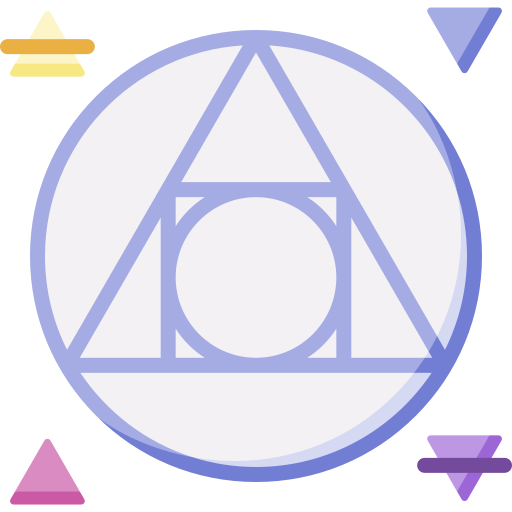
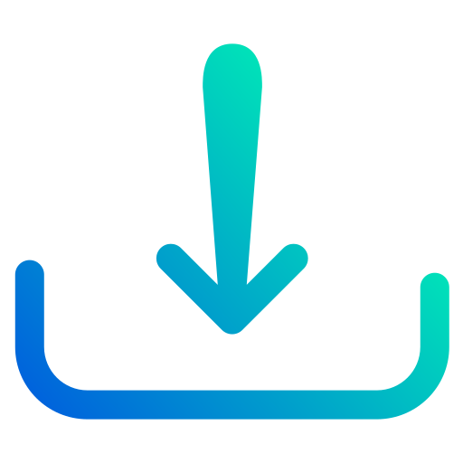
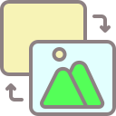
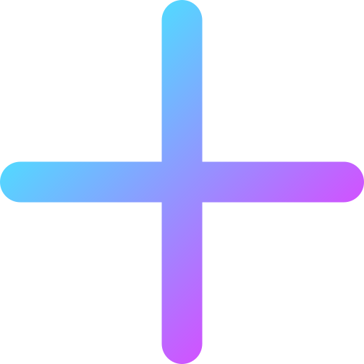
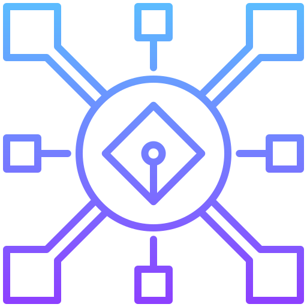

# Attributions

All the icons used on this project are from [Flaticon](https://www.flaticon.com/).

| Description (Link) | Icon |
| ---- | ---- |
| [Philosopher's Stone](https://www.flaticon.com/free-icon/philosophers-stone_4330742?term=alchemy&page=1&position=33&origin=search&related_id=4330742) |  |
| [Import](https://www.flaticon.com/free-icon/download_6096626?term=import&page=1&position=58&origin=search&related_id=6096626) |  |
| [Remove](https://www.flaticon.com/free-icon/remove_3133904?term=remove&page=1&position=5&origin=search&related_id=3133904) |  |
| [Replace](https://www.flaticon.com/free-icon/find_1665743?term=replace&page=1&position=18&origin=search&related_id=1665743) |  |
| [Stack](https://www.flaticon.com/free-icon/layers_3308315?term=ui&page=1&position=2&origin=search&related_id=3308315) |  |
| [Gallery](https://www.flaticon.com/free-icon/gallery_10054290?term=image&related_id=10054290) |  |
| [Shrink](https://www.flaticon.com/free-icon/shrink_4979964?term=shrink&page=2&position=20&origin=search&related_id=4979964) |  |
| [Expand](https://www.flaticon.com/free-icon/expand_747941?term=expand&page=2&position=12&origin=search&related_id=747941) |  |
| [Sum](https://www.flaticon.com/free-icon/positive-sign_7782645?term=add&page=1&position=2&origin=search&related_id=7782645) |  |
| [Trash](https://www.flaticon.com/free-icon/remove_3133791?term=remove&page=1&position=1&origin=search&related_id=3133791) |  |
| [Centralized](https://www.flaticon.com/free-icon/centralized_9692223?term=centralized&page=1&position=5&origin=search&related_id=9692223) |  |
